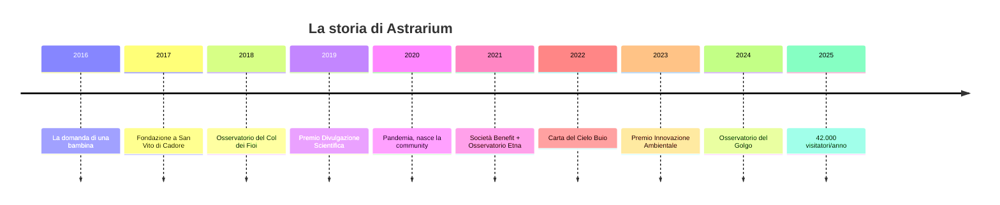

# ASTRARIUM — Storia

## 2016 — La notte che ha cambiato tutto

Novembre 2016. **Elena Moretti**, astrofisica di formazione e divulgatrice, accompagna un gruppo di turisti a una serata di osservazione su un prato di San Vito di Cadore. Tra loro c'è una famiglia con una bambina di otto anni. Quando la Via Lattea appare sopra le cime, la bambina chiede: *"Ma il cielo è sempre così? Perché a casa non l'ho mai visto?"*

Quella domanda diventa il seme di Astrarium. Elena inizia a raccogliere dati: in Italia il 70% della popolazione non ha mai visto la Via Lattea ad occhio nudo. Le aree di cielo buio esistono, ma sono prive di strutture, accessibilità e narrazione.

## 2017 — La fondazione

Il 14 luglio 2017 — notte di Perseidi in anticipo — Elena fonda Astrarium con tre soci: **Marco Turrini** (ingegnere ottico, oggi direttore tecnico), **Giulia Sanna** (architetta specializzata in strutture low-impact, oggi responsabile progetti) e **Pietro Alba** (imprenditore turistico cadorino, oggi CEO).

Il capitale iniziale: € 380.000, tra risparmi, famiglia e un prestito d'onore. Il primo ufficio è una stanza sopra il panificio del paese.

## 2018 — Il primo osservatorio

Dopo un anno di trattative con il Comune e la Comunità Ampezzana, nasce l'**Osservatorio del Col dei Fioi**: una cupola di 6 metri su una struttura in legno locale, un riflettore da 600 mm, 18 posti letto nella "Casa del Cielo" adiacente.

Prima stagione: 2.800 visitatori. L'azienda chiude in perdita, ma il passaparola è straordinario.

## 2019–2020 — La prova

Il 2019 porta i primi riconoscimenti (Premio Nazionale per la Divulgazione Scientifica) e i primi programmi scolastici strutturati. Poi la pandemia: tutti i tour sospesi per 8 mesi.

Astrarium sopravvive reinventandosi: webinar di astronomia, "Cielo da casa" (kit di osservazione spediti a domicilio), corsi online di astrofotografia. 1.200 partecipanti. L'azienda scopre di avere una community, non solo clienti.

## 2021 — La svolta: Società Benefit

Astrarium è tra le prime aziende del turismo italiano a convertirsi in **Società Benefit**. La scelta è strategica e culturale: il profitto serve alla missione, non il contrario.

Nasce l'**Osservatorio dell'Etna Nord**, frutto di una partnership con l'INGV: osservazione solare di giorno, cieli vulcanici di notte. Primo bilancio in utile: € 96.000.

## 2022–2023 — La Carta del Cielo Buio

L'azienda lancia il progetto che la definisce: la **Carta del Cielo Buio**, un protocollo con cui i comuni si impegnano a ridurre l'inquinamento luminoso (illuminazione a spettro caldo, orari ridotti, schermature). 

Nel 2023: 9 comuni firmatari, 1.400 ettari con illuminazione ridotta. Astrarium vince il **Premio Nazionale Innovazione Ambientale**. Nasce la linea di astrofotografia "Prime Luci" e i ritiri residenziali.

## 2024 — Il terzo osservatorio

Apre l'**Osservatorio del Golgo** in Sardegna, sul plateau basaltico di Baunei: Bortle 1, tra i cieli più bui d'Italia, accanto ai nuraghi e alle domus de janas. Il progetto integra archeoastronomia e astronomia: i cieli osservati dagli antichi, spiegati con la scienza di oggi.

## 2025 — Oggi

42.000 visitatori, 34 dipendenti, tre osservatori, 14 comuni nella Carta del Cielo Buio, 6.400 studenti all'anno. Elena Moretti è direttore scientifico. Il sogno di una bambina di otto anni è diventato un'azienda che esiste per far sì che nessun bambino debba più fare quella domanda.

## La linea del tempo in breve

